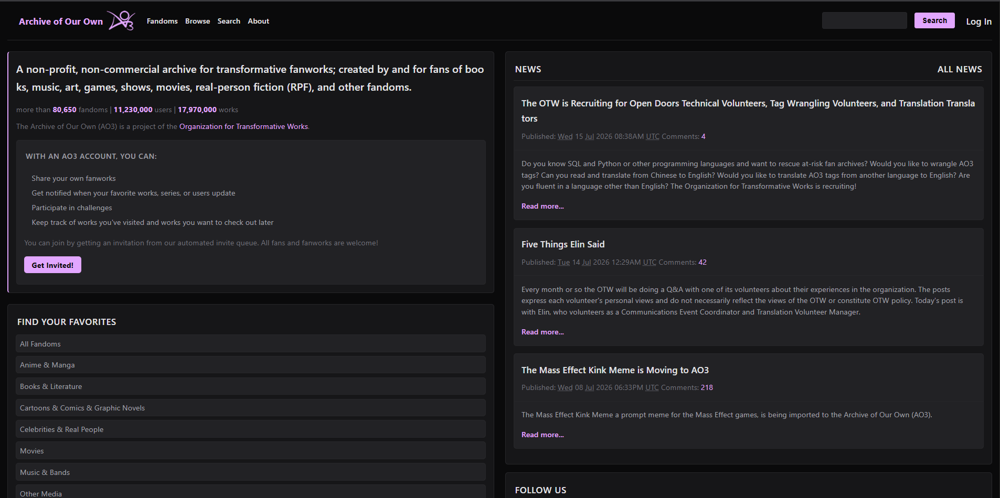
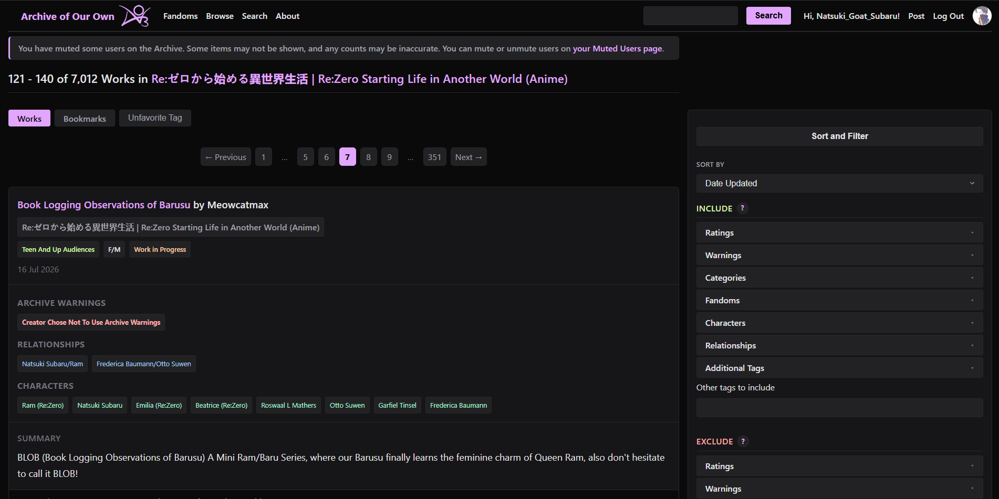
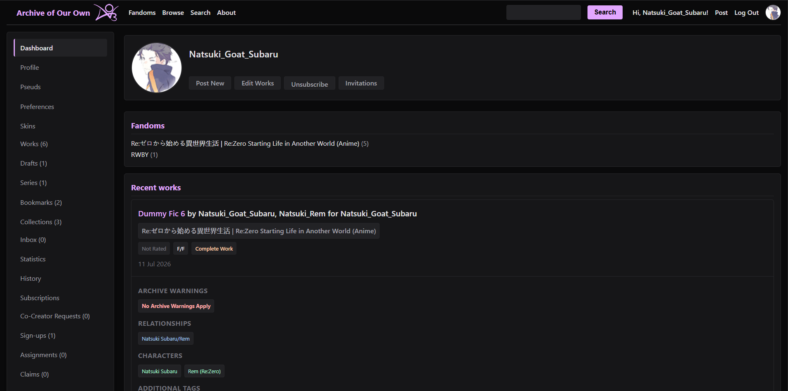
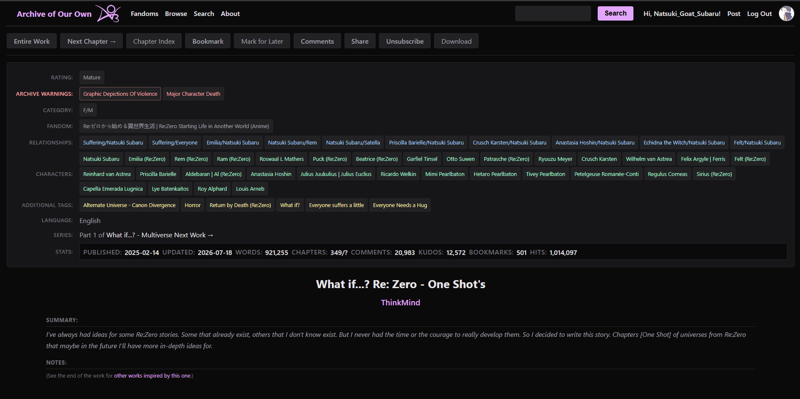
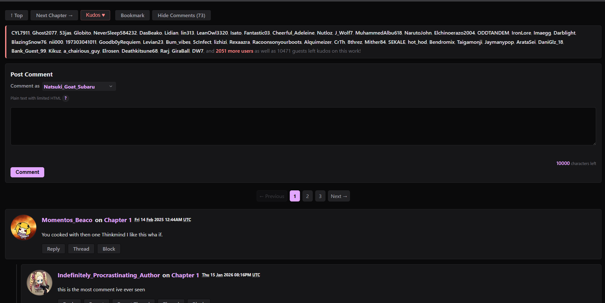
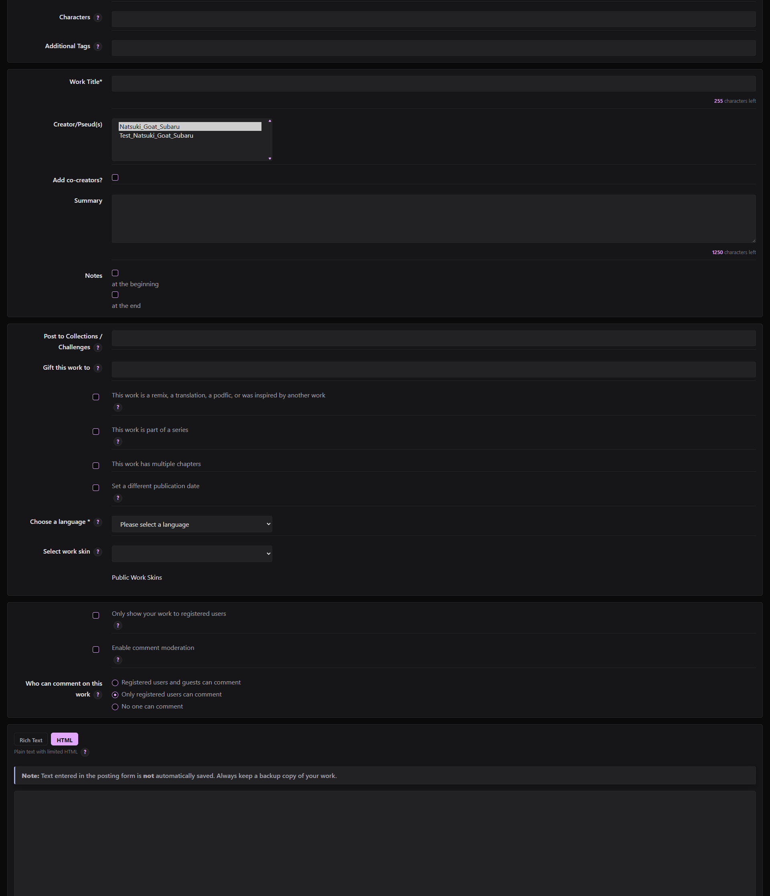

# Obsidian AO3

A dark theme for Archive of Our Own — free, ad-free, and built for comfortable reading.

**Obsidian AO3** is a Chrome extension that gives AO3 a sleek dark interface. Install it, and the theme applies instantly across the entire site. No account setup, no custom CSS required.

---

## Why This Exists

AO3's bright white backgrounds get uncomfortable after hours of reading. This extension gives you a dark, consistent look everywhere on the site.

---

## Features

- **Dark theme everywhere** — works, chapters, search, dashboard, inbox, bookmarks, and more
- **Easy on the eyes** — readable text and high contrast
- **Works without hassle** — just install and go
- **Lightweight** — pure css and js, no package bloat

---

## Installation

### Chrome Web Store

*(Coming soon – link will be added once published)*

### Firefox Add-ons

*(Coming soon – link will be added once published)*

### Manual Installation (Developer Mode)

1. Download or clone this repository.
2. Open Chrome and go to `chrome://extensions/`.
3. Enable **Developer mode** (toggle in the top right).
4. Click **Load unpacked** and select the extension folder.
5. The extension icon will appear in your toolbar.

---

##  Showcase

Screenshots taken from [What if...? Re: Zero - One Shot's](https://archiveofourown.org/works/63041911/chapters/161451277) (Go checkout his works)

| Homepage | Works/Fic Page |
|----------|-----------------|
|  |  |

| Dashboard | Single Fic Metadata |
|-----------|-------------------|
|  |  |

| Comments | Post/Create New |
|----------|-----------------|
|  |  |

---

##  Supported Pages

Works on most AO3 pages including:

- Works index / browse pages
- Chapter view (reading mode)
- Search & filter pages
- Dashboard & profile
- Inbox & comments
- Bookmarks & collections
- Series & challenge pages
- Statistics & trends
- Gift exchanges & challenges

**Some pages may not be fully styled** — AO3 dynamically creates many page layouts, and i may have miss some of it. If a page looks broken or unstyled, [open an issue](https://github.com/PixelStarForge/Obsidian-Ao3/issues) with the URL and a screenshot, and i will try to fix it

---

## Troubleshooting

### The theme isn't appearing

- Reload the extension: go to `chrome://extensions`, find Obsidian AO3, click the refresh icon
- Hard-refresh AO3 tabs: `Ctrl+Shift+R` (Windows/Linux) or `Cmd+Shift+R` (Mac)
- Check that Developer Mode is still enabled

### Some pages look broken

- I might have missed a page. Open an issue with:
  - The AO3 page URL
  - A screenshot
  - Your browser and version
- I will look into it

### Does this work on mobile?

- The Responsiveness was made with mobile layout in mind, but there is no way to use extension on mobile browser except firefox android. When it will be approved on firefox addons you could use it on firefox android

---

##  Contributing

Contributions are welcome. This is a open source project, and improvements benefit everyone.

### How to contribute

1. **Fork** the repository
2. **Create a feature branch:** `git checkout -b fix/broken-layout`
3. **Make changes** (CSS, JavaScript, or both)
4. **Test thoroughly** on the affected AO3 pages
5. **Submit a pull request** with a clear description of what changed and why

### Guidelines

- **Keep it lean.** CSS-first solutions; JS only for dynamic content.
- **Respect AO3.** Don't modify functionality, redirect traffic, or inject ads.
- **Test widely.** Check your changes on multiple AO3 pages, not just one.

---

##  Feedback

Found a bug? Have a suggestion? Ideas for improvements?

- **Open an issue** on GitHub with details
- **Be specific:** include the AO3 page, what you expected, what happened instead
- **Be kind:** we're all volunteers here

---

**Enjoy reading"

